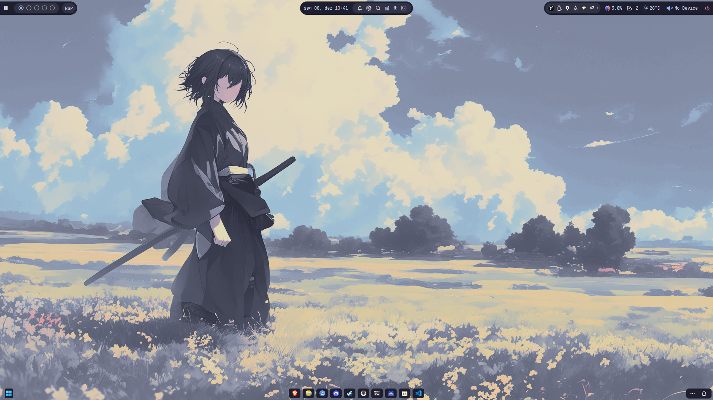
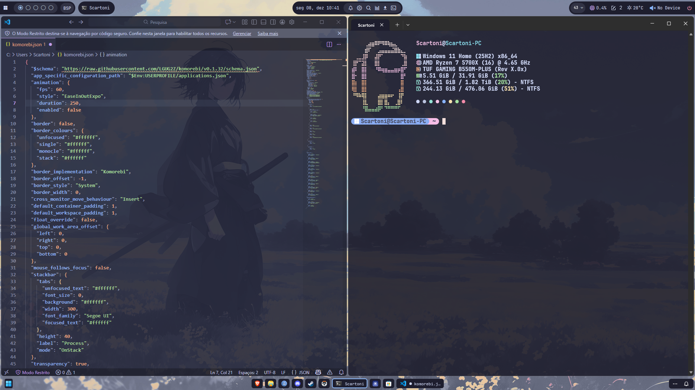

<div align="center">
  <h1>🍧 Toni's Dotfiles</h1>
  <p>My personal Windows 11 configuration focused on productivity and Dark aesthetics (Catppuccin style).</p>

  
  <br /><br />
  

  <br /><br />

  
  
  
  
</div>

---

## 🛠️ About the Setup

Configuration files to transform the Windows 11 experience into a Tiling Window Manager environment, inspired by Linux workflows.

| Component | Tool | Description |
|-----------|------|-------------|
| **Window Manager** | [Komorebi](https://github.com/LGUG2Z/komorebi) | Automatic tiling window management. |
| **Status Bar** | [YASB](https://github.com/amnweb/yasb) | Custom top bar with widgets and CSS styling. |
| **Taskbar** | [Windhawk](https://windhawk.net/) | Mods to customize the native taskbar and system tray. |

## 🚀 Installation Guide

### 1. Clone the Repository
Open your terminal (PowerShell or CMD) and run:

```bash
git clone https://github.com/scartoni/dotfiles.git
cd dotfiles
```
### 2. Configure Komorebi
Move the configuration file to your user profile folder:
* Copy `configs/komorebi/komorebi.json`
* Paste it into `C:\Users\YOUR_USER\` (or just `$Env:USERPROFILE` in PowerShell).

### 3. Configure YASB
* Go to your **YASB installation folder** (usually inside `.yasb` in your user folder).
* Replace the existing `config.yaml` and `styles.css` with the ones found in `configs/yasb/`.
* Restart YASB.

### 4. Setup Windhawk Mods
Since Windhawk doesn't support importing files directly yet, you need to apply the mods manually:
1.  Open **Windhawk**.
2.  Search for the mod name (e.g., "Taskbar Styler").
3.  Go to the **Advanced** tab of the mod.
4.  Open the corresponding `.json` file from `configs/windhawk/` in Notepad.
5.  Copy the code and paste it into the "Mod Settings" area.
6.  Click **Save**.

---
<div align="center">
  Made by <b>Toni</b> 🇯🇲
</div>
